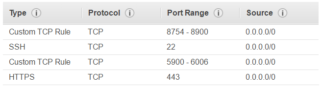

# Installation Guide
> Initial version by Toke Faurby, [Toke.Faurby@gmail.com](mailto:toke.faurby@gmail.com), and  Kristoffer Linder-Steinlein, [linder2411@gmail.com](mailto:linder2411@gmail.com), **November 2016**.
> 
> Revised by Toke Faurby, [Toke.Faurby@gmail.com](mailto:toke.faurby@gmail.com), **January 2017**.

___
 

## Introduction
For this course we will be using Amazon Web Services ([AWS](https://aws.amazon.com/products/)). AWS provide on-demand computing facilities. Most notably they provide servers with the powerful [NVIDIA Tesla K80](http://www.nvidia.com/object/tesla-k80.html) graphics cards, which we will be using for this course. These servers are called [p2.xlarge](https://aws.amazon.com/ec2/instance-types/p2/), and cost about 1 $US per hour of runtime. For large tasks it is possible to save money by using [spot instances](https://aws.amazon.com/ec2/spot/pricing/). A spot instances let you bid on spare Amazon EC2 instances to name your own price for compute capacity. The Spot price fluctuates based on the supply and demand of available EC2 capacity. Spot prices are generally a lot lower, e.g. p2.xlarge costs about 0.2 $US, but you risk being outbid, and having your server shut down, without notice (bad for interactive sessions, good for big batch jobs).

All the necessary software has been installed and configured on the servers, so all you have to do is connect to them, requiring only minimal setup on your part. If you would like to dig deeper or get the software running on your own computer a list of resources have been curated in the end of this guide.

**SECURITY WARNING**

The servers and material for this course haven't been made with security in mind, therefore assume that somebody could access your server, and any the data you put on it.

## Setup

> **INFO**: For the remainder of this guide **background information**, **debugging tips**, **optional steps** etc. are indented like this, where as necessary steps and important information are shown as normal text.

You only need to set up the system once. Once setup is complete simply follow the instructions in *Daily Use*.

> **INFO**: We have setup some Amazon Machine Images (AMI), and will be hosting them through our AWS account. In order to interface with the machines you will have to use AWS Command Line Interface (CLI). 

To get AWS CLI working we need:
* a Bash shell, 
* Python (any recent version will do), and 
* pip (a package manager for Python). 

If you are on a **Mac or Linux** you already have these, and you can **skip** to the section _Everybody_. If you are on **Windows**, you need to get these first.

> **INFO**: *A Note on Python versions*: The servers that you will be using runs Python 2.7 (it doesn't matter what runs on your local computer). The deep learning community has been slow to adopt 3.5, and many still use 2.7, and thus a lot of software is written in 2.7. Some of the software for the exercises requires Python 2.7, and we will therefore use this version. Google (developers of [TensorFlow](https://www.tensorflow.org/get_started/), the framework we will use for this workshop) however are prioritizing Python 3.5. It is therefore worth considering using this version going forward. If you wish to use Theano and Lasagne (another framework), then you are probably better of with 2.7. 

### Windows People
Unlike the other OSs Windows doesn't come with a Bash shell, so we need to install one. We suggest Git Bash. 

> **ALTERNATIVE**: [Bash on Ubuntu on Windows](https://msdn.microsoft.com/en-us/commandline/wsl/install_guide) might also work, we haven't tested this.

[Click here](https://git-scm.com/downloads) and download the newest version of Git Bash. [AWS CodeCommit](http://docs.aws.amazon.com/codecommit/latest/userguide/setting-up-https-windows.html#setting-up-https-windows-install-git) supports **Git versions >= 1.7.9**. Most of the installation settings aren't that important, so just choose the defaults. However on the first dialog box, called `Select Components`, tick all the boxes, if they aren't already.

Use Git Bash as your shell for the remainder of this guide.

> **INFO**: We won't need the Git capabilities for this course, we simply need to use it as a Bash shell. But if you don't already know how to use Git and GitHub you defineatly should get familiar with it! There are plenty of tutorials, but if you like videos you can watch the first couple of videos [here](https://www.youtube.com/watch?v=cEGIFZDyszA&list=PL6gx4Cwl9DGAKWClAD_iKpNC0bGHxGhcx). Github is very widely used to collaborate, share code, and build up a personal portfolio.

We also need to install **Python**.

> **ALTERNATIVE**: If you wish to use Python form your personal computer for more than this course we suggest install [Anaconda](https://www.continuum.io/downloads). This will install what you need for this course, as well as lot of other useful software. The installer will ask you whether you want to add Python as a default, and whether it should be added to your environment path. You should tick both of these options. Alternatively you can install just the base Python:

Download and install [Python](https://www.python.org/downloads/). `pip` is automatically installed but you need to [update](https://pip.pypa.io/en/stable/installing/#upgrading-pip) it. Open Git Bash, and type:

    python -m pip install -U pip

> **DEBUG**: If you get an error her there is a good change your **environmental variables** aren't setup correctly, so your computer doesn't know where Python is. Either fix this ([this might help](http://stackoverflow.com/questions/3701646/how-to-add-to-the-pythonpath-in-windows-7)), or write the full path to Python. I.e. write: ` C:\full\path\to\python.exe -m pip install -U pip`.

### Everybody
Install AWS CLI by typing the following in your shell:

**Windows and Linux**:

    pip install awscli

**Mac**:

    pip install awscli --ignore-installed six

> **DEBUG:** If you run into trouble with the installation, please consult [this site](http://docs.aws.amazon.com/cli/latest/userguide/installing.html#install-with-pip).

### AWS Configuration 
>**Requires**: `<Access_ID>` and `<Secret_Key>`. If you are using your own AWS account you should be able to create/view them from [this link](https://console.aws.amazon.com/iam/home?#/home). Otherwise you should have received these in an email.

> **INFO**: Once AWS CLI is installed we need to configure it. We have created a user for you with the privileges to start and stop a server (read more [here](http://docs.aws.amazon.com/AWSSimpleQueueService/latest/SQSGettingStartedGuide/AWSCredentials.html)). 

Type in your shell, while inserting the appropriate `<Access_ID>` and `<Secret_Key>` values:

    aws configure
    AWS Access Key ID []: <Access_ID>
    AWS Secret Access Key []: <Secret_Key>
    Default region name []: eu-west-1

Leave the rest as their default (just press enter).

You also need an E2C Secret Key, `<E2C_key>.pem`. If you are using our servers, [click here](https://www.dropbox.com/s/tmu10eklgc0cdh4/DLLondon12017.pem) to download it. Save it somewhere that is easy to access. You will need to use this file everytime you want to `SSH` into your server. Set the permissions using your shell:

    cd <path to .pem file>
    chmod 400 <PEM_NAME>.pem

> **DEBUG**: If you are unsure how to `cd` using a shell, please consult [this](http://askubuntu.com/questions/520778/how-can-i-change-directories-in-the-shell):

## Daily Use
>**Requires**: `<AWS instance ID>`. If you are using your own AWS account you should be able to create/view them from [this link](https://eu-west-1.console.aws.amazon.com/ec2/v2/home?region=eu-west-1#). Otherwise you will receive this the first day of the workshop. 

> **INFO**: The `<AWS instance ID>` is used to identify your instance. You will use the same instance for the entire of the course. The `AWS instance ID` will look something like this: `i-0123456789abcdefg`.

> **TIP**: The follwing commands will be used a couple of times through out the workshop. We recommend writing them somewhere for easy copy-paste use.

Turn on the server (in a shell):

    aws ec2 start-instances --instance-ids <AWS instance ID>

> **INFO**: The server is hosted at a **public DNS address**. We need for connecting to the server. The DNS change value every time the server is shut down.

Get the **public DNS**:

    aws ec2 describe-instances --instance-ids <AWS instance ID> | grep PublicDns

This will print the public DNS address (several times). Copy-paste it somewhere for the rest of the day. Now we will connect to the actual server through `SSH`.

    cd <path to .pem file>
    ssh -i <PEM_NAME>.pem -L 8888:localhost:8888 ubuntu@<PublicDns>
    Are you sure you want to continue connecting (yes/no)? yes
    
We are now connected to the instance. If you wish to disconnect, and get you Bash shell back type `exit`. 

> **OPTIONAL**: We strongly suggest using `screen` ([guide](https://www.rackaid.com/blog/linux-screen-tutorial-and-how-to/)) ([quick reference](http://aperiodic.net/screen/quick_reference)). Linux `screen` allows you to:
>   * Keep a shell active even through network disruptions.
>   * Run a long running process without maintaining an active shell session.
>   * Use multiple shell windows from a single SSH session.
>   * Disconnect and re-connect to a shell sessions from multiple locations.
>
> This is VERY handy, as you will lose your work if you lose internet connection otherwise!

Start the exercises (if on your own server download them from [here](https://github.com/DeepLearningDTU/02456-deep-learning)):

    cd 02456-deep-learning/
    jupyter notebook --no-browser --port=8888

We have now started a Jupyter server and ported it through the `SSH` connection. View the exercises by opening your browser (e.g. **Chrome**) and in the address bar typing:

    localhost:8888

> **DEBUG**: Previous participants had trouble using **Safari**. Use Chrome instead.

You should now see an overview of the course material. **Enjoy**!

> **INFO**: You can If you have multiple instances of Jupyter running (or other processes using your ports) simply change the number `8888` in all of the above (with the settings of this AMI it must however be between `8754` and `8900`). Check the output in the shell if the above doesn't work.

**NB: When you are done**, or not using your server please shut it down. In your shell (it doesn't matter if you are connected via `SSH` or not) type:

    aws ec2 stop-instances --instance-ids <AWS instance ID>

Thank you!

### Save your work
> **NOTE Jan. 2017**: This method is very bad and slow (will be updated). You should zip it before downloading.

If you want to keep the exercises, and the work that you did:

    cd <path to .pem file>
    scp -i <PEM_NAME>.pem -r ubuntu@<publicDNS>:~/02456-deep-learning/ <destination folder>

set `<destination folder` to `.` if you want to download it to the current folder

All the course material is also available through [github](https://github.com/DeepLearningDTU/02456-deep-learning).

### Next steps
After this course there are many ways to improve your deep learning skills. Some options are:
* Competing in [Kaggle](https://www.kaggle.com/) competitions.
* Very good course from Stanford University: [CS231n: Convolutional Neural Networks for Visual Recognition](http://cs231n.github.io/)
* [Coursera](https://www.coursera.org/courses?languages=en&query=deep+learning) and [edX](https://www.edx.org/course?search_query=intelligence) often have good free online courses.
* If you want to be on the cutting edge the best way is to reproduce the results of scientific papers. There are many places you can find these, some options are:
    * [r/MachineLearning](https://www.reddit.com/r/MachineLearning/) and [r/DeepLearning](https://www.reddit.com/r/deeplearning/) are good for news about papers.
    * [Arxiv-Sanity](http://www.arxiv-sanity.com/) helps you navigate the flood of papers on [Arxiv](https://arxiv.org/), a website for scientific papers.
    * Twitter. A lot of big deep learning people tweet about their research, like [Yann LeCun](https://twitter.com/ylecun), [Demis Hassabis](https://twitter.com/demishassabis) (DeepMind), [Nando de Freitas](https://twitter.com/NandoDF), [Andrej Karpathy](https://twitter.com/karpathy), [Andrew Ng](https://twitter.com/AndrewYNg), and a lot more! (And on an unrelated note, [so am I](https://twitter.com/Faur9000).)

## On your own
> **INFO**: This section is intended to help you setup your own servers.

### Amazon Web Services
Create an [AWS account](https://aws.amazon.com/). 

You need to **request permission** to use `p2.xlarge` servers. [Click here](http://aws.amazon.com/contact-us/ec2-request) to request this.

> **INFO**: These are not available at all regions at time of writing (Jan. 2017). We suggest the **Ireland region** as it is where the course AMI is available (see below). Processing time can be up to a couple of days.

**NB** If you haven't already, setup your local computer (go to top of this guide and follow it until you reach '**AWS Configuration**').

You need to configure AWS CLI with your own `<Access_ID>` and `<Secret_Key>`. [Click here](https://console.aws.amazon.com/iam/home#/home) to create/view them.

> **INFO**: The AMI used for this course is made public in **Ireland**. There are many AMI made available with a lot of software pre-installed. E.g. the AMI used for the 2016 iteration of this course is based on [this one](https://github.com/Miej/GoDeeper). You can also create your own.

Create an instance:

* Going to [this address](https://eu-west-1.console.aws.amazon.com/ec2/v2/home). 
* Make sure you have `Ireland` selected as your region.
* Click `Launch Instance`. 
* **1. Choose AMI**
    * Click `Community AMIs`
    * Search for **NOTE Jan. 2017**: *AMI is still under development*
        * (for 2016 version use `ami-b991c7ca`).
* **2. Choose Instance Type**
    * Pick `p2.xlarge` 
* **3. Configure Instance**
    * Leave at default
* **4. Add Storage**
    * Leave at default
* **5. Add Tags**
    * Name your instance
* **6. Configure Security Group**
    * You will need to configure your `Security Group`. These settings are simple and work, but don't really account for security concerns. For this course the following has been used:
    
    * The `Custom TCP Rules` are necessary for hosting Jupyter Notebooks over the internet (not used currently).
* Click Launch
 * If you don't already have a `.pem` file create one, and save it. You will need it everytime you log on to your instance.

### Setting up your own AMI
> **INFO**: Getting all the necessary software working on your own computer can be cumbersome, but things have gotten **A LOT** better in recent years, even on Windows, which was notoriously difficult. 

The following guides were very useful at time of writing (Jan 2017):
* [Getting CUDA 8 to Work With OpenAI Gym on AWS and Compiling TensorFlow for CUDA 8 Compatibility](https://davidsanwald.github.io/2016/11/13/building-tensorflow-with-gpu-support.html)
* [Zero Configuration Remote Jupyter Server](http://www.justinkiggins.com/blog/zero-configuration-remote-jupyter-server/)
* [Running an iPython Notebook Server on AWS - EC2 Instance](http://blog.impiyush.com/2015/02/running-ipython-notebook-server-on-aws.html)
* [Running a notebook server](http://jupyter-notebook.readthedocs.io/en/latest/public_server.html#notebook-server-security)

# Feedback
We love **feedback**. Either submit a pull request, email one of the most recent creators of this guide (see top), or catch a TA during the exercises.

Things we are aware of, but haven't gotten around to:
* Create reference solutions.
* Use [sparse max](https://github.com/AndreasMadsen/course-02456-sparsemax) attention for Lab 3
