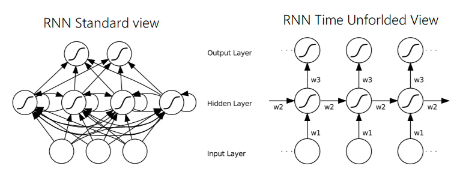

# Lab 3: Recurrent Neural Networks

Recurrent neural networks (RNN) are the natural type of neural network to use for sequential data e.g. time series analysis, translation, speech recognition, biological sequence analysis etc.
RNNs works by recursively applying the same operation to an input $x_t$ and its own hidden state from the previous timestep $h_{t-1}$.
That is to say that each layer can be described by the function $f$:

$$y_t, h_t = f(x_t, h_{t-1})$$

where $y_t$ is the output.
An RNN can therefore handle input of varying length.

*Image by [Alex Graves](https://www.cs.toronto.edu/~graves/preprint.pdf)*

#### External resources
* The code describing RNNs can be tricky to understand at first. 
R2T2 has a great tutorial series ([part 1](https://r2rt.com/recurrent-neural-networks-in-tensorflow-i.html), [part 2](https://r2rt.com/recurrent-neural-networks-in-tensorflow-ii.html)) that digs into the details of how RNNs are implemented in TensorFlow. This introduction is heavily inspired by part 1.
* For more in depth background material on RNNs please see [Supervised Sequence Labelling with Recurrent
Neural Networks](https://www.cs.toronto.edu/~graves/preprint.pdf) by Alex Graves
* Lastly there is an [official TensorFlow tutorial](https://www.tensorflow.org/tutorials/recurrent) that is also worth a look